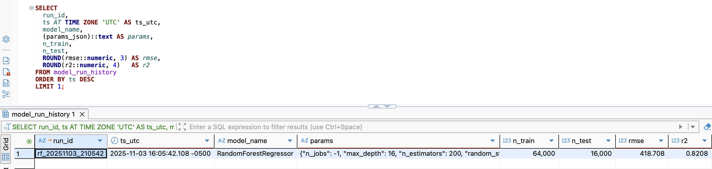
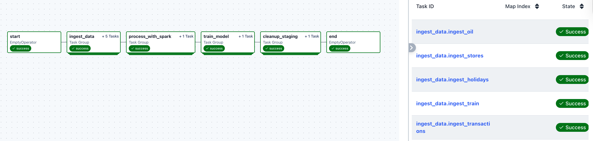
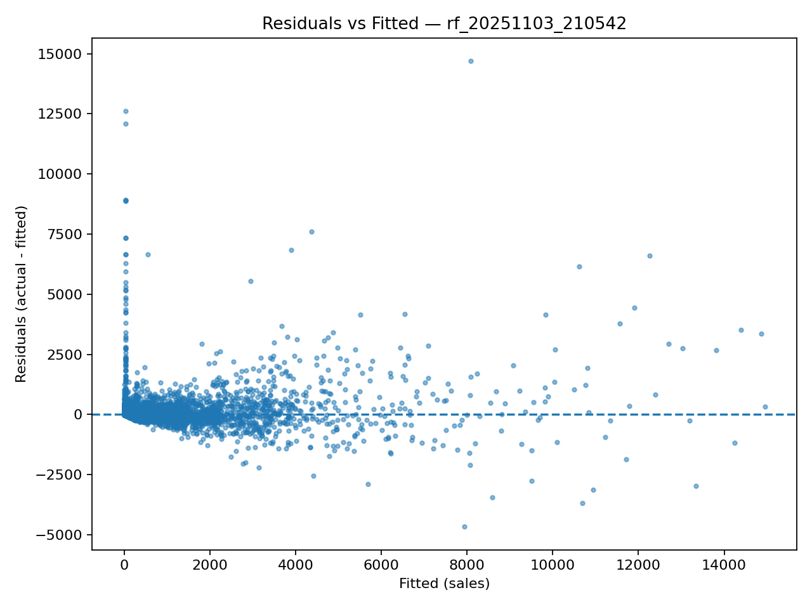

# Store Sales Pipeline
An end-to-end **Airflow + Spark + Postgres** pipeline that ingests CSV data, builds a feature mart, trains a lightweight model, and saves artifacts (model file + charts).

### Overview
- **Objective:** provide a robust, repeatable data pipeline for medium-to-large CSVs and produce a small, explainable baseline model.

- **Stack:** Docker Compose, Airflow (Celery), Spark (PySpark), Postgres, Redis, scikit-learn.

- **Schedule:** the DAG runs with `@daily`.

- **Outputs:**

    - Postgres table: `sales_features_mart`

    - Artifacts on host: trained model (.joblib), feature-importance plot, residuals plot

### Architecture
```
Docker Compose
 ├─ Postgres (db) + Redis (broker)
 ├─ Airflow services (api, scheduler, worker, ...)
 └─ Host volumes
     ./dags       -> /opt/airflow/dags
     ./data       -> /opt/airflow/data
     ./artifacts  -> /opt/airflow/artifacts
```
Image: custom Airflow image with OpenJDK 17 (for Spark) and required Python packages.

## Data Flow & Troubleshooting

### A) Ingest: CSVs → Postgres staging (Spark)

**Data size note:** main dataset **train.csv ≈ 217 MB**. It triggered ingestion failures when loaded with pandas inside workers.


#### Initial issues (pandas path)

- `pandas.read_csv` in Airflow workers was slow and memory-heavy on large files.

- Write to Postgres succeeded but was unstable under memory pressure.

#### Spark migration issues

- Java missing → install OpenJDK 17 and set `JAVA_HOME`.

- No JDBC driver → add `org.postgresql:postgresql:42.5.0` via `spark.jars.packages`.

- Airflow connection not set → create `postgres_main_db` in UI.

- Type drift (e.g., onpromotion boolean vs integer) → enforce explicit Spark schemas, cast onpromotion to INT, and always write staging in overwrite mode.

#### Stable approach

- Read with Spark using explicit schemas and minimal casting.

- Repartition the fact file on `date` to parallelize parsing.

- Write each dataset to staging via JDBC with batch size.

### B) Transform: staging → feature mart (Spark)

#### Bottlenecks

- Skew and single-partition work during joins; driver memory limits during wide shuffles.

#### Stability measures

- Docker resources increased (e.g., RAM ≥ 16 GB).

- Spark tuned:

    - `spark.driver.memory=6g`, `spark.executor.memory=4g`, `spark.driver.maxResultSize=2g`

    - `spark.sql.adaptive.enabled=true`, `spark.sql.shuffle.partitions=200`

- Repartitioned fact table with `repartition(64, "store_nbr", "date")`

- Broadcast joins for small tables (stores, holiday flags, oil)

- Columns reduced early; dates cast before joins.

- Oil price filled forward then backward by date to remove gaps.

#### Result
- Feature mart `sales_features_mart` written with JDBC (`batchsize=5000`, `truncate=true`) in a predictable runtime.

### C) Model: quick baseline (Python)

#### Constraints

- Full-table training is slow and unnecessary for a baseline check.

#### Approach

- Random sample of 80k rows from `sales_features_mart`.

- Train **RandomForestRegressor** on `log1p(sales)` and persist artifacts under `/opt/airflow/artifacts` (mapped to `./artifacts`).

#### Observed quality

- Typical run: **R² ≈ 0.82, RMSE ≈ 414** after back-transform.


## DAG & Tasks

- **File:** dags/store_sales_pipeline.py

- **Parallelism:** ingestion uses **five Spark tasks** that run concurrently under CeleryExecutor (one per CSV), then the transform, model, and cleanup run in order.

1. **ingest_data.spark_ingest_csvs**

    Reads CSVs with explicit schemas (`train`, `transactions`, `oil`, `stores`, `holidays_events`), normalizes types (e.g., `date`, `store_nbr`, `sales`, `onpromotion` as INT), and writes **staging tables** to Postgres in overwrite mode.

2. **process_with_spark.transform_with_spark**

    Reads staging via JDBC; trims columns; casts dates; fills oil; creates holiday flags (national / regional by state / local by city); joins fact with stores, transactions, oil, and holidays using **broadcast joins**; adds calendar features; writes `sales_features_mart` with batched/truncated JDBC.

3. **train_model.train_simple_model**

    Samples 80k rows; one-hot encodes low-cardinality features (`cluster`, `day_of_week`, `month`, `family`); trains Random Forest on **log1p(sales)**; logs R² and RMSE; saves:

    - rf_timestamp.joblib

    - rf_timestamp_featimp_top30.png

    - rf_timestamp_residuals.png

4. **cleanup_staging.cleanup_staging_tables**

    Drops all *_staging tables after a successful run.

    `start` / `end` `EmptyOperator`s mark boundaries.

## Setup & Run

#### Prerequisites

- Docker Desktop with ≥ 16 GB RAM and some swap.

#### Build & start

```
docker compose up -d --build
```

#### Airflow UI

- http://localhost:8080 (user/pass: airflow / airflow)

#### Add connection `postgres_main_db`

- Conn Type: Postgres

- Host: db, Port: 5432, Schema: airflow_db

- Login: vscode, Password: vscode

#### Trigger

- In Airflow UI, run `store_sales_pipeline`.

- Final table: `sales_features_mart` (Postgres).

- Artifacts: `./artifacts` on the host.

#### Re-run

- Optionally **Clear** tasks in UI (keeps data) and trigger again; staging will be overwritten and the mart rebuilt.

## Modeling

#### Purpose
Validate the end-to-end pipeline and highlight signals that drive daily sales. This is a baseline, not a production forecaster.

#### Target
`sales` per (`store_nbr`, `family`, `date`), modeled as `log1p(sales)`.

#### Key predictors

- Promotion: onpromotion

- Store activity: store_transactions

- Calendar: day_of_week, month, year

- Macro: oil_price (filled)

- Store profile: cluster, store_type

- Product: family

- Holiday context: is_national_holiday, is_regional_holiday, is_local_holiday, holiday_type

#### Typical importance pattern

- onpromotion — strongest positive effect

- store_transactions — strong demand proxy

- family dummies — category effects

- calendar + holiday flags — seasonality / event effects

- oil_price — small, sometimes directional


#### Performance

- R² ≈ 0.82 (log scale training; metrics reported on original scale)

- RMSE ≈ 414

- Residuals mostly around zero with larger spread at high fitted values (expected for sales).


#### Takeaway

The baseline confirms that the engineered features are informative and the pipeline is healthy. For production, a time-aware model with lag features or a global hierarchical forecaster is the next step.

## Useful parameters

| Area        | Parameter                            | Value / Note             |
| ----------- | ------------------------------------ | ------------------------ |
| JDBC Write  | `batchsize`                          | **5000**                 |
| Spark       | `spark.sql.shuffle.partitions`       | **200**                  |
| Repartition | `repartition(…, "store_nbr","date")` | **64** in transform step |

## Tips for reusable items

- Use explicit Spark schemas for CSVs to avoid type drift.

- Repartition large facts and broadcast small dimensions to stabilize joins.

- Cast dates before joins; drop unused columns early to shrink shuffles.

- Ensure the image contains JDK and add the JDBC driver via spark.jars.packages.

- Mount an artifacts folder for models and plots.

- If JDBC writes fail, check column types in Postgres vs Spark DataFrame casts.

## Project Layout

```
.devcontainer/Dockerfile   # Airflow + JDK 17 + pip install
docker-compose.yml         # services + volumes
requirements.txt           # pyspark, psycopg, sklearn, matplotlib...
dags/store_sales_pipeline.py
data/                      # CSV inputs
artifacts/                 # model + charts (host)
config/, logs/, plugins/   # Airflow folders
```

## Next Steps

- Add rolling lags/aggregations per (store_nbr, family).

- Use time-based validation (rolling origin).

- Add SHAP or permutation importance.

- Compare LightGBM/XGBoost and add scheduled retraining in the DAG.